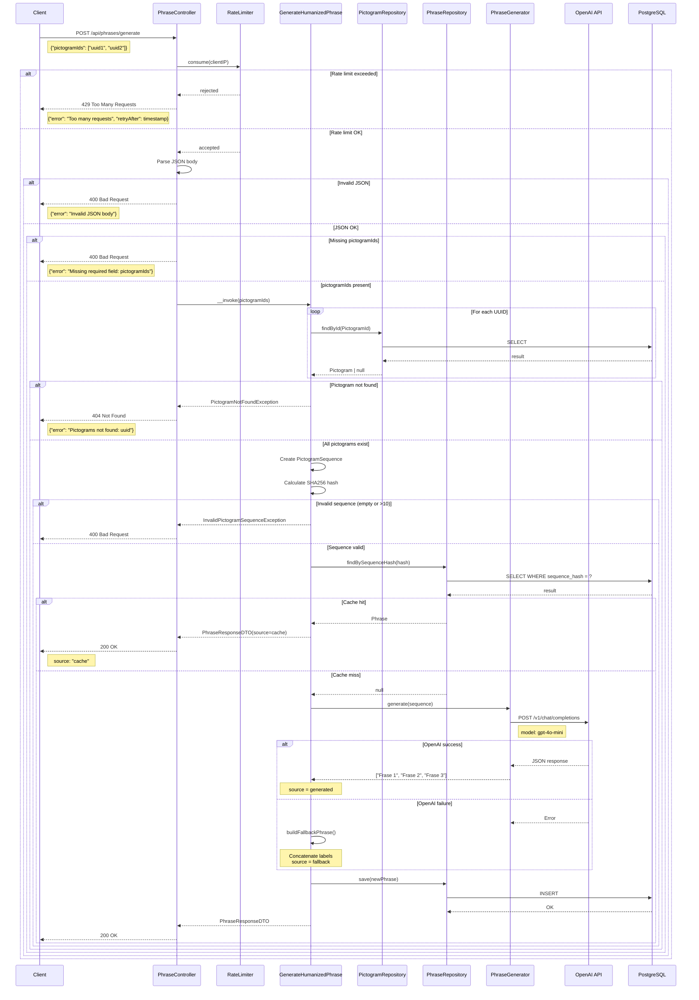
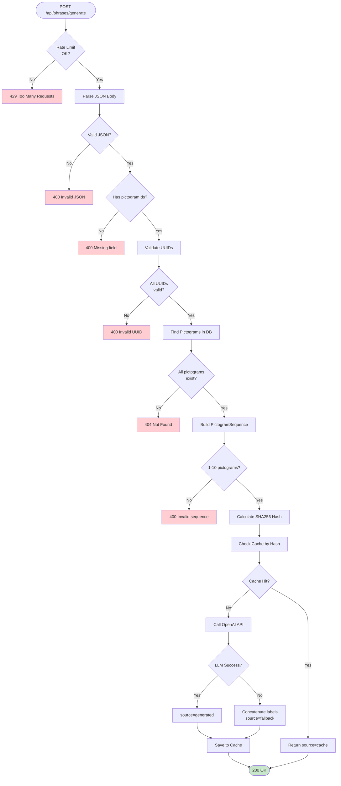
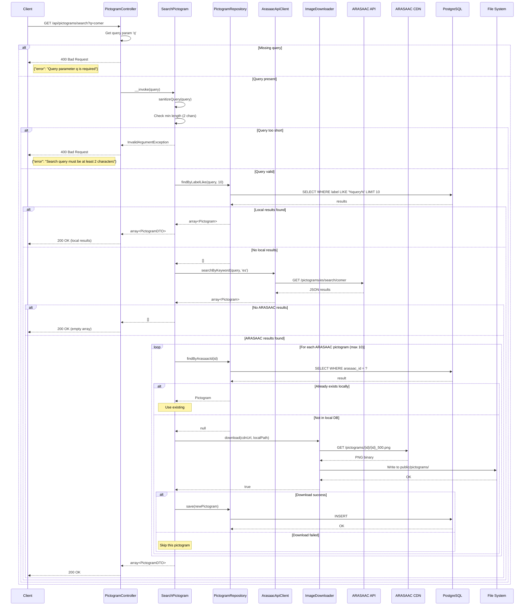
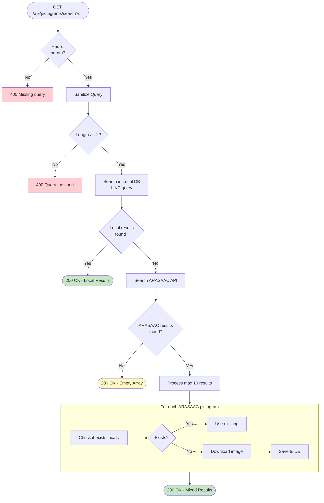
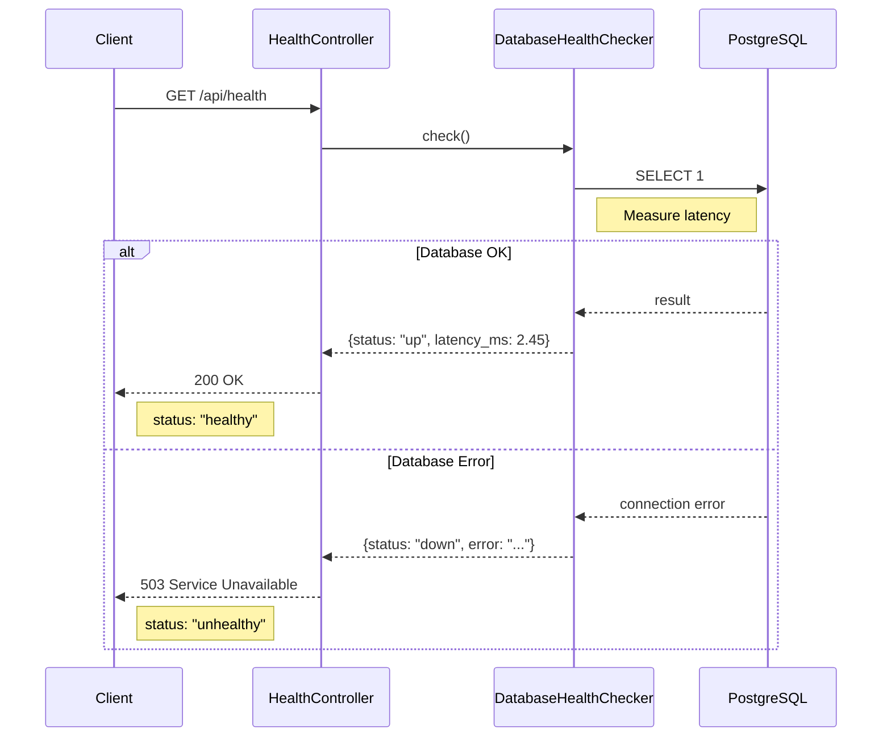
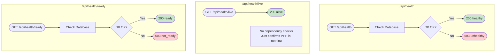

# API Flow - Diagramas

> Diagramas de flujo de las APIs principales de HablaIA

## Flujo de Generacion de Frase (POST /api/phrases/generate)

Este es el **Core MVP feature** de HablaIA.

### Diagrama de Secuencia Completo



### Diagrama de Flujo Simplificado



### Posibles Respuestas

| Codigo | Escenario | Ejemplo Response |
|--------|-----------|------------------|
| **200** | Exito (cache/generated/fallback) | `{"variations": [...], "source": "generated", ...}` |
| **400** | JSON invalido | `{"error": "Invalid JSON body"}` |
| **400** | Campo faltante | `{"error": "Missing required field: pictogramIds"}` |
| **400** | UUID invalido | `{"error": "Invalid UUID format"}` |
| **400** | Secuencia invalida | `{"error": "Pictogram sequence cannot be empty"}` |
| **404** | Pictograma no existe | `{"error": "Pictograms not found: uuid"}` |
| **429** | Rate limit excedido | `{"error": "Too many requests", "retryAfter": 1234567890}` |

---

## Flujo de Busqueda de Pictograma (GET /api/pictograms/search?q=)

### Diagrama de Secuencia Completo



### Diagrama de Flujo Simplificado



### Posibles Respuestas

| Codigo | Escenario | Ejemplo Response |
|--------|-----------|------------------|
| **200** | Resultados encontrados (local o ARASAAC) | `[{"id": "...", "label": "comer", ...}]` |
| **200** | Sin resultados | `[]` |
| **400** | Query faltante | `{"error": "Query parameter q is required"}` |
| **400** | Query muy corta | `{"error": "Search query must be at least 2 characters"}` |

---

## Flujo de Health Check (GET /api/health)

### Diagrama de Secuencia



### Diagrama de Flujo



### Kubernetes Configuration

```yaml
livenessProbe:
  httpGet:
    path: /api/health/live
    port: 8080
  initialDelaySeconds: 5
  periodSeconds: 10
  failureThreshold: 3

readinessProbe:
  httpGet:
    path: /api/health/ready
    port: 8080
  initialDelaySeconds: 10
  periodSeconds: 5
  failureThreshold: 3

startupProbe:
  httpGet:
    path: /api/health/ready
    port: 8080
  initialDelaySeconds: 0
  periodSeconds: 5
  failureThreshold: 30
```

---

## Resumen de APIs

| Endpoint | Metodo | Proposito | Latencia Esperada |
|----------|--------|-----------|-------------------|
| `/api/health` | GET | Monitoring general | <10ms |
| `/api/health/live` | GET | Kubernetes liveness | <1ms |
| `/api/health/ready` | GET | Kubernetes readiness | <10ms |
| `/api/categories` | GET | Listar categorias | <50ms |
| `/api/categories/{id}` | GET | Detalle categoria | <20ms |
| `/api/pictograms` | GET | Listar pictogramas | <100ms |
| `/api/pictograms/search` | GET | Buscar pictogramas | <2s (con ARASAAC) |
| `/api/pictograms/{id}` | GET | Detalle pictograma | <20ms |
| `/api/phrases/generate` | POST | Generar frase | <200ms (cache) / <3s (LLM) |

> **Nota Performance:** El objetivo es <200ms en p95 para operaciones criticas de UX.
> La generacion de frases con LLM puede tomar hasta 3s la primera vez, pero respuestas
> cacheadas se sirven en <50ms.
