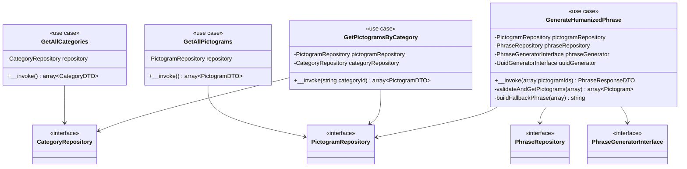
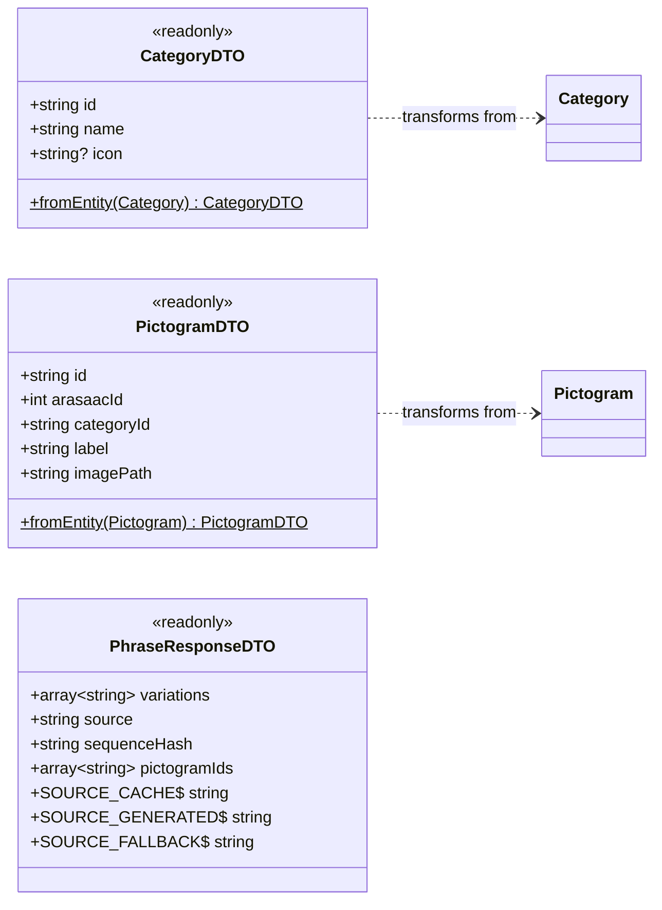
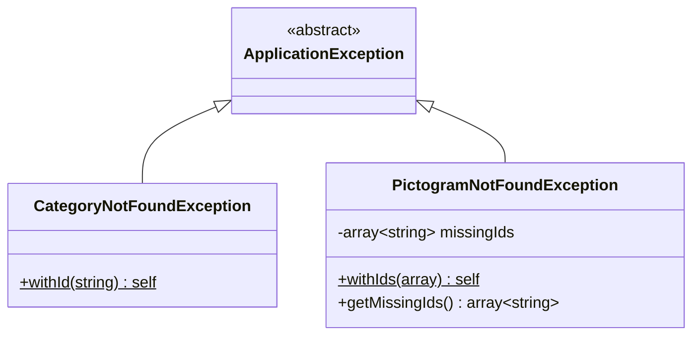
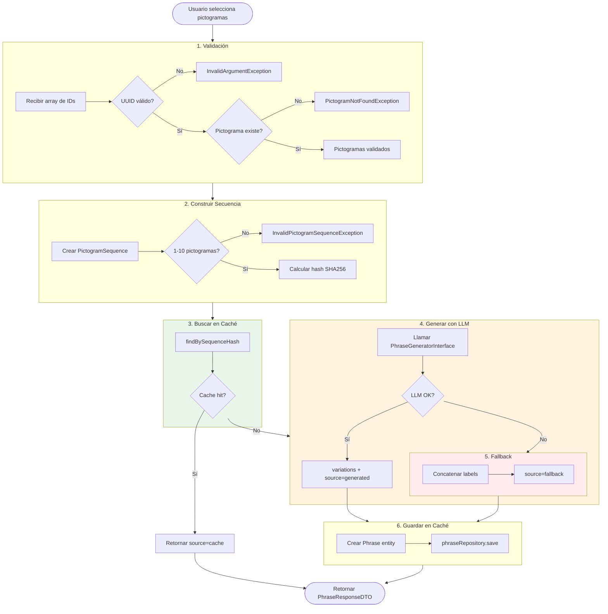
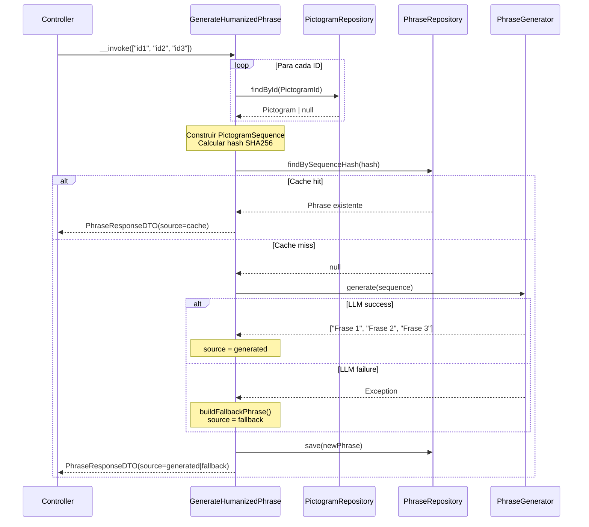
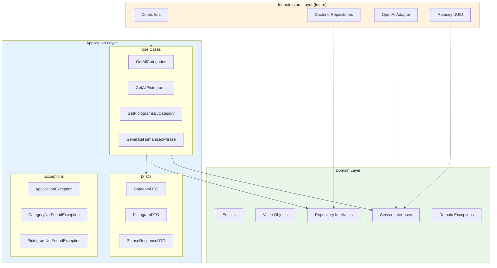
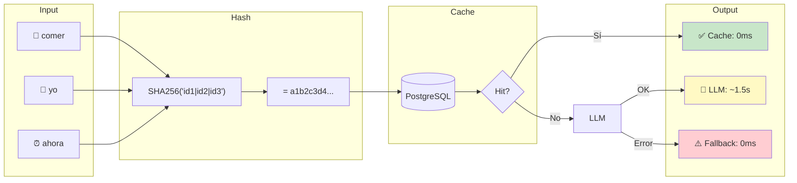

# Application Layer - Diagramas

> Diagramas del Application Layer de HablaIA

## Diagrama de Use Cases

## Diagrama de DTOs

## Diagrama de Excepciones

## Flujo de GenerateHumanizedPhrase

## Diagrama de Secuencia - GenerateHumanizedPhrase

## Arquitectura de Capas

## Resumen de Componentes

| Módulo | Use Cases | DTOs | Excepciones |
|--------|-----------|------|-------------|
| **Category** | `GetAllCategories` | `CategoryDTO` | `CategoryNotFoundException` |
| **Pictogram** | `GetAllPictograms`, `GetPictogramsByCategory` | `PictogramDTO` | `PictogramNotFoundException` |
| **Phrase** | `GenerateHumanizedPhrase` | `PhraseResponseDTO` | - |

## Principios SOLID Aplicados

| Principio | Aplicación |
|-----------|------------|
| **S** - Single Responsibility | Cada Use Case hace una sola cosa |
| **O** - Open/Closed | Nuevos generadores sin modificar Use Cases |
| **L** - Liskov Substitution | FakePhraseGenerator intercambiable con OpenAI |
| **I** - Interface Segregation | Interfaces pequeñas y específicas |
| **D** - Dependency Inversion | Use Cases dependen de interfaces, no implementaciones |

## Estrategia de Caché

> **Nota:** El hash SHA256 garantiza que secuencias idénticas siempre produzcan el mismo hash, permitiendo cacheo eficiente sin duplicados.

## Tests Coverage

| Use Case | Tests | Assertions |
|----------|-------|------------|
| `GetAllCategories` | 2 | 6 |
| `GetAllPictograms` | 7 | 35 |
| `GetPictogramsByCategory` | 8 | 40 |
| `GenerateHumanizedPhrase` | 14 | 27 |
| **Total** | **31** | **108+** |

> **Cobertura objetivo:** 80% Application Layer (cumplido con 31 tests)
