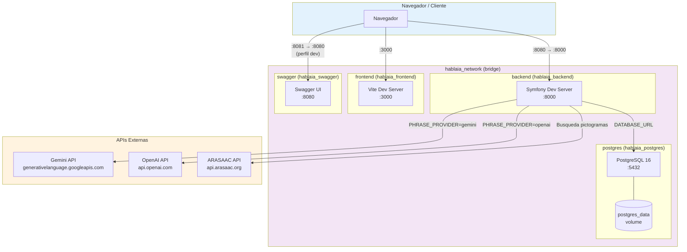
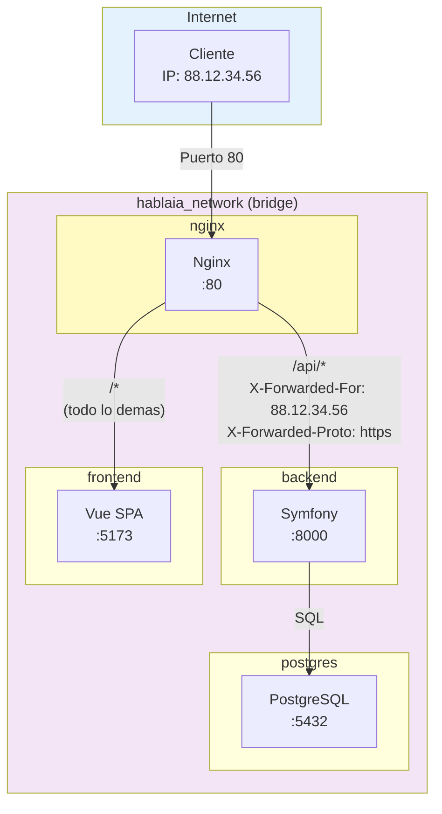
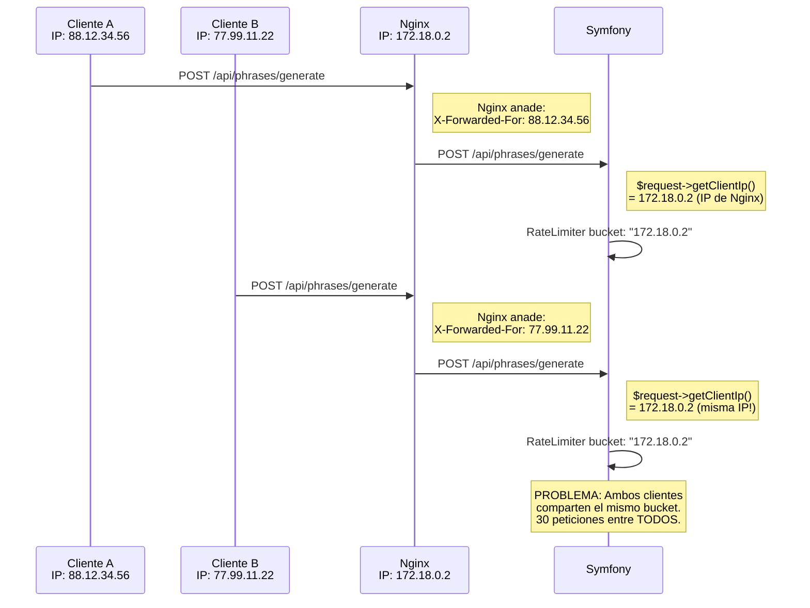
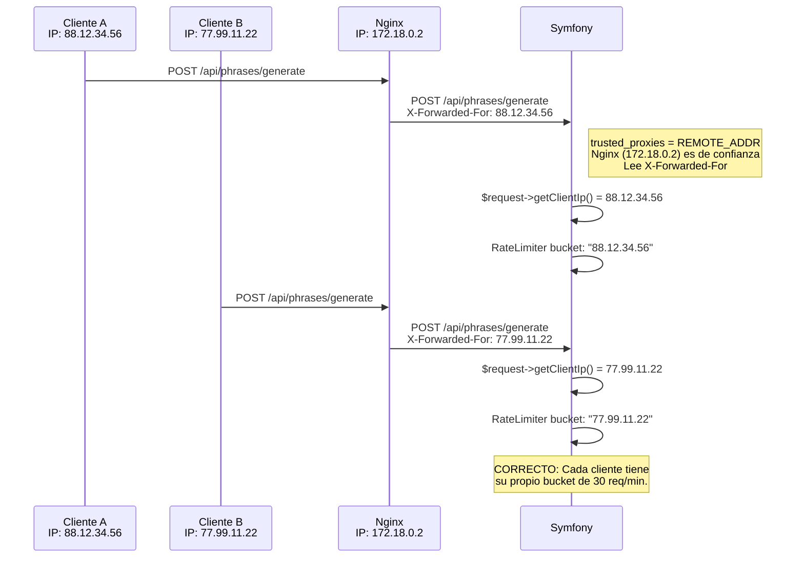
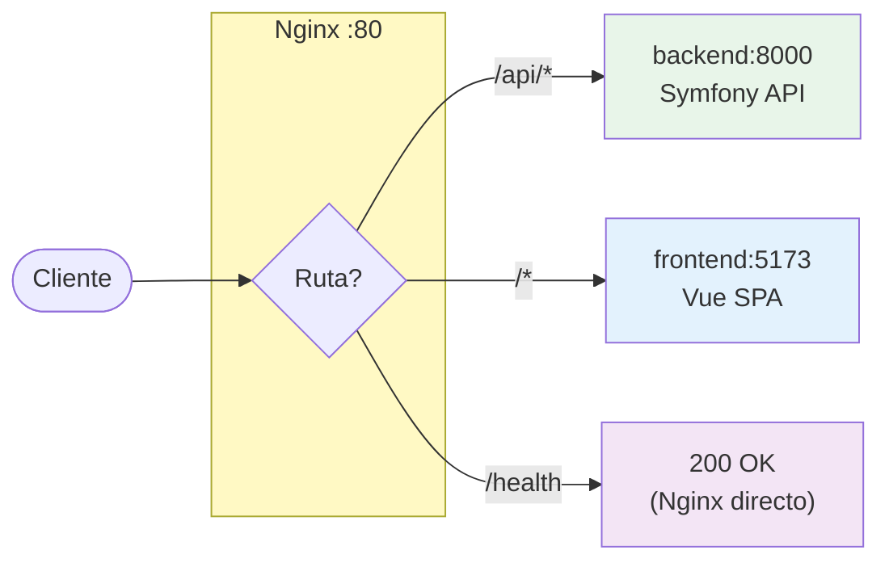
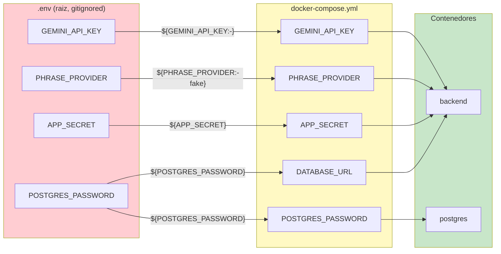

# Docker Infrastructure - Diagramas

> Arquitectura de contenedores, red interna y flujo de peticiones HTTP de HablaIA

## Arquitectura de Contenedores (Desarrollo)

## Arquitectura con Nginx Reverse Proxy (Produccion)

En produccion, Nginx actua como punto de entrada unico y distribuye las peticiones
entre backend y frontend. Esto es donde `trusted_proxies` cobra importancia.

## Flujo de IP: Por que se necesita `trusted_proxies`

Sin `trusted_proxies`, Symfony ve la IP del contenedor Nginx, no la del cliente real.
Esto afecta directamente al **rate limiter** del endpoint `/api/phrases/generate`.

### Sin trusted_proxies (problema)

### Con trusted_proxies (solucion)

## Configuracion Nginx (docker/nginx/default.conf)

### Cabeceras que Nginx anade al Backend

| Cabecera | Valor | Uso en Symfony |
|----------|-------|----------------|
| `X-Real-IP` | IP real del cliente | Referencia |
| `X-Forwarded-For` | IP del cliente + cadena de proxies | `$request->getClientIp()` (con trusted_proxies) |
| `X-Forwarded-Proto` | `http` o `https` | `$request->isSecure()` |
| `Host` | Hostname original | Generacion de URLs |

## Puertos Expuestos (Desarrollo)

| Servicio | Puerto Host | Puerto Contenedor | URL |
|----------|-------------|-------------------|-----|
| **Backend** | 8080 | 8000 | http://localhost:8080/api |
| **Frontend** | 3000 | 3000 | http://localhost:3000 |
| **PostgreSQL** | 5432 | 5432 | postgresql://localhost:5432 |
| **Swagger** | 8081 | 8080 | http://localhost:8081 (perfil dev) |

## Variables de Entorno Clave

> **Seguridad:** El `.env` de la raiz esta en `.gitignore`. Solo `.env.example` con valores
> placeholder se commitea al repositorio. Las claves API reales solo existen localmente.
