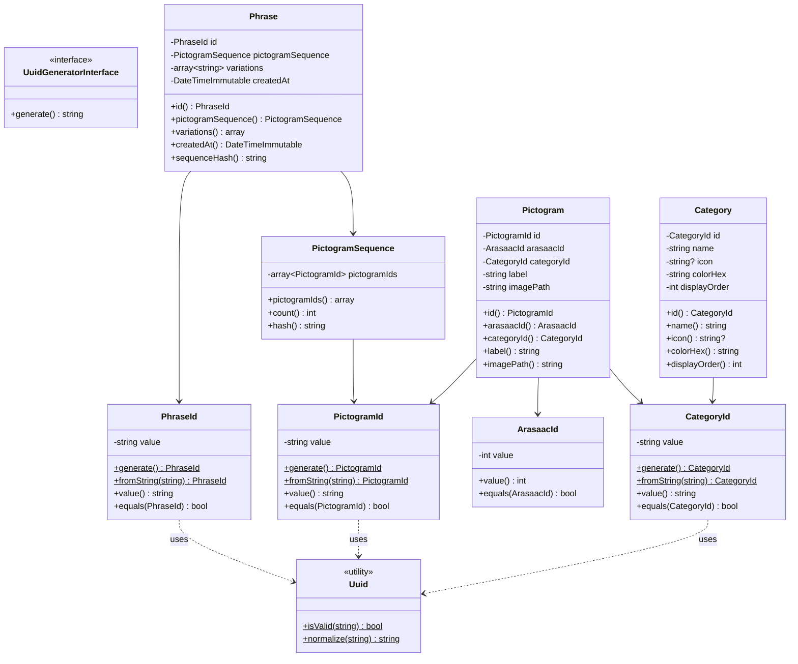
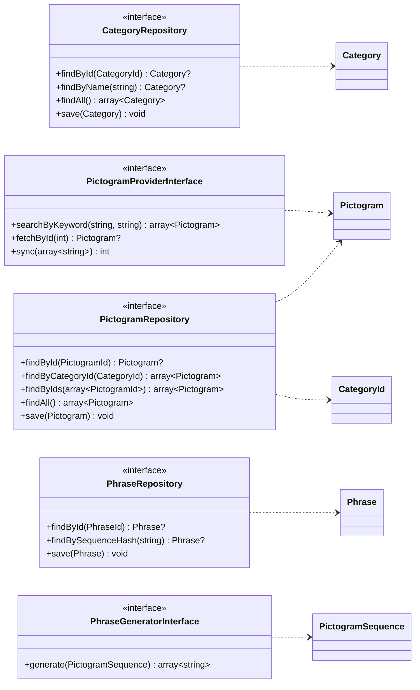
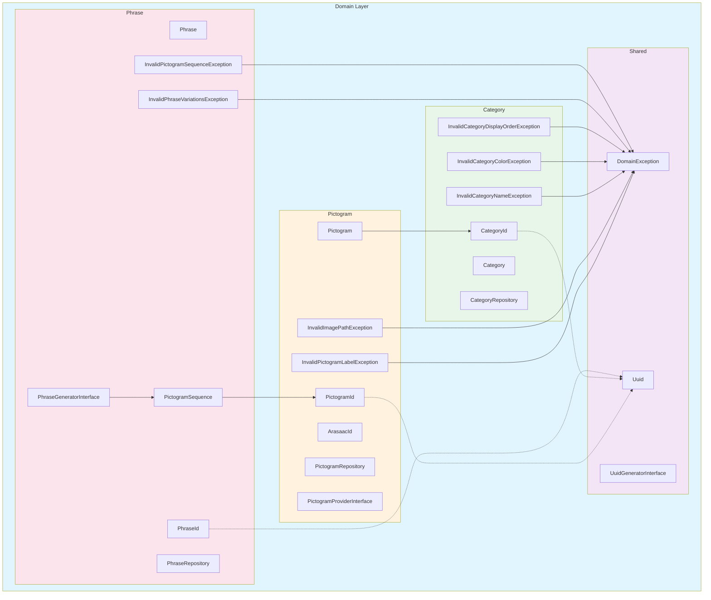
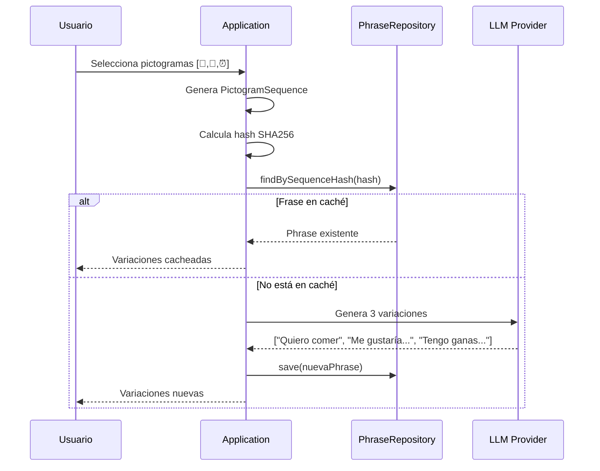

# Domain Layer - Diagramas

> Diagramas del Domain Layer de HablaIA

## Diagrama de Clases

## Diagrama de Repositorios y Servicios

> **Nota:** Las interfaces de servicio permiten cambiar proveedores sin modificar el dominio:
> - `PhraseGeneratorInterface` → OpenAI, Claude, Gemini, etc.
> - `PictogramProviderInterface` → ARASAAC, Mulberry Symbols, etc.

## Diagrama de Módulos

## Flujo de Caché de Frases

> **Nota:** LLM Provider implementa `PhraseGeneratorInterface`. Inicialmente OpenAI GPT-4o-mini.

## Diagrama de Excepciones

```mermaid
classDiagram
    direction TB

    class DomainException {
        <<abstract>>
    }

    class InvalidPictogramLabelException {
        -int? actualLength
        -int? maxLength
        +tooLong(int, int)$ self
        +empty()$ self
        +getActualLength() int?
        +getMaxLength() int?
    }

    class InvalidImagePathException {
        -string? path
        +pathTraversalDetected(string)$ self
        +empty()$ self
        +getPath() string?
    }

    class InvalidCategoryNameException {
        -int? actualLength
        -int? maxLength
        +tooLong(int, int)$ self
        +empty()$ self
        +getActualLength() int?
        +getMaxLength() int?
    }

    class InvalidCategoryColorException {
        +invalidFormat(string)$ self
        +empty()$ self
    }

    class InvalidCategoryDisplayOrderException {
        +negative(int)$ self
    }

    class InvalidPhraseVariationsException {
        -int? actualCount
        -int? maxCount
        -int? index
        -int? actualLength
        -int? maxLength
        +tooMany(int, int)$ self
        +empty()$ self
        +variationTooLong(int, int, int)$ self
    }

    class InvalidPictogramSequenceException {
        -int? actualCount
        -int? maxCount
        +tooMany(int, int)$ self
        +empty()$ self
    }

    DomainException <|-- InvalidPictogramLabelException
    DomainException <|-- InvalidImagePathException
    DomainException <|-- InvalidCategoryNameException
    DomainException <|-- InvalidCategoryColorException
    DomainException <|-- InvalidCategoryDisplayOrderException
    DomainException <|-- InvalidPhraseVariationsException
    DomainException <|-- InvalidPictogramSequenceException
```

> **Nota:** Todas las excepciones de dominio extienden `DomainException`, permitiendo captura semántica en Application/Infrastructure.

## Resumen

| Módulo | Entidad | Value Objects | Excepciones | Repositorio | Servicio |
|--------|---------|---------------|-------------|-------------|----------|
| **Shared** | - | `Uuid` | `DomainException` | - | `UuidGeneratorInterface` |
| **Pictogram** | `Pictogram` | `PictogramId`, `ArasaacId` | `InvalidPictogramLabelException`, `InvalidImagePathException` | `PictogramRepository` | `PictogramProviderInterface` |
| **Category** | `Category` | `CategoryId` | `InvalidCategoryNameException`, `InvalidCategoryColorException`, `InvalidCategoryDisplayOrderException` | `CategoryRepository` | - |
| **Phrase** | `Phrase` | `PhraseId`, `PictogramSequence` | `InvalidPhraseVariationsException`, `InvalidPictogramSequenceException` | `PhraseRepository` | `PhraseGeneratorInterface` |

> **Nota sobre Uuid:** `Uuid` solo valida formato UUID v4 (RFC 4122). La generación se delega a `UuidGeneratorInterface`, cuya implementación vive en Infrastructure (inyección de dependencias).

## Validaciones de Seguridad

| Entidad | Validación | Motivo |
|---------|------------|--------|
| `Pictogram` | `imagePath` no contiene `..` | Prevenir path traversal |
| `Pictogram` | `label` máx 100 chars | Prevenir DoS |
| `Category` | `name` máx 50 chars | Prevenir DoS |
| `Phrase` | `variations` máx 3, 500 chars c/u | Límite LLM + DoS |
| `PictogramSequence` | Máx 10 pictogramas | Límite razonable |
