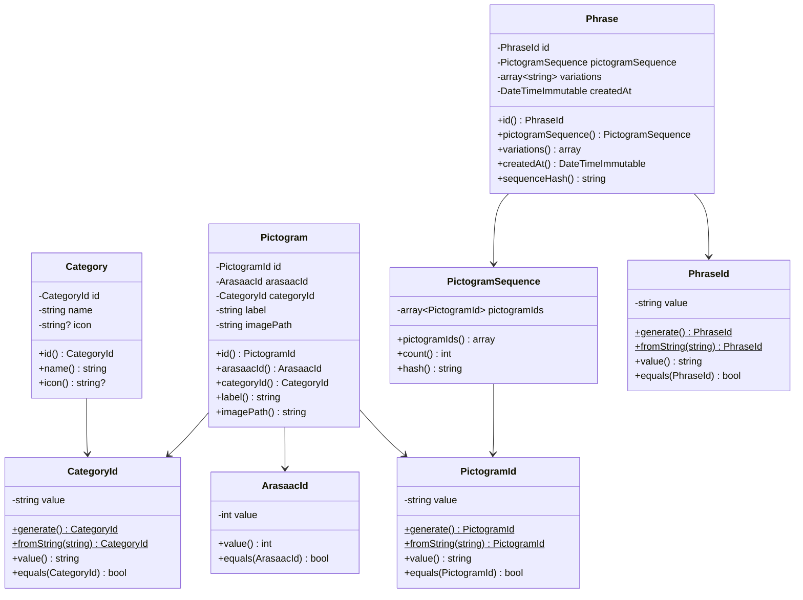
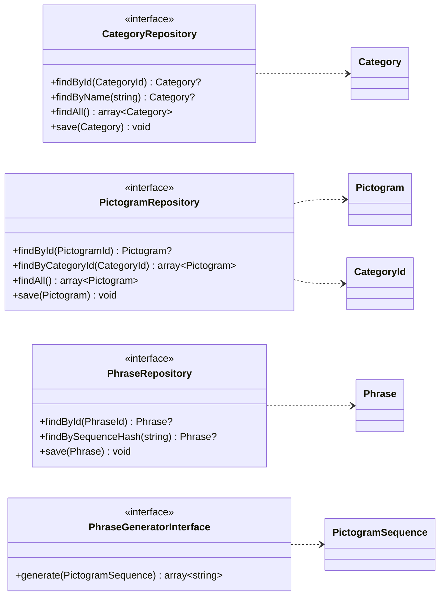
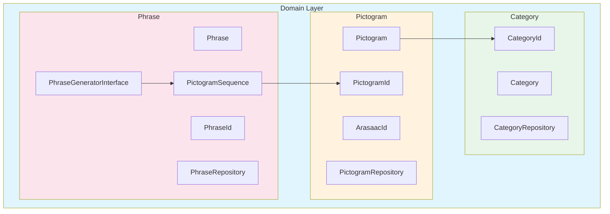
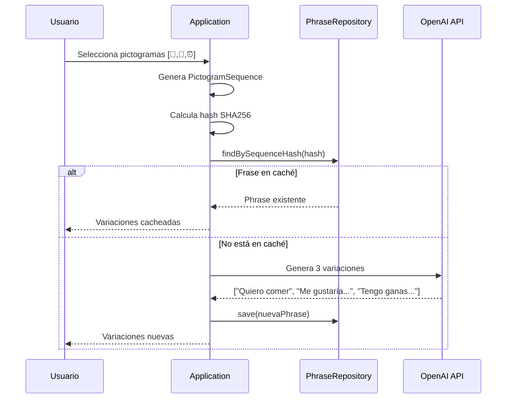

# Domain Layer - Diagramas

> Diagramas del Domain Layer de HablaIA

## Diagrama de Clases

## Diagrama de Repositorios y Servicios

> **Nota:** `PhraseGeneratorInterface` permite cambiar el proveedor de IA (OpenAI, Claude, Gemini, etc.) sin modificar el dominio.

## Diagrama de Módulos

## Flujo de Caché de Frases

## Resumen

| Módulo | Entidad | Value Objects | Repositorio | Servicio |
|--------|---------|---------------|-------------|----------|
| **Pictogram** | `Pictogram` | `PictogramId`, `ArasaacId` | `PictogramRepository` | - |
| **Category** | `Category` | `CategoryId` | `CategoryRepository` | - |
| **Phrase** | `Phrase` | `PhraseId`, `PictogramSequence` | `PhraseRepository` | `PhraseGeneratorInterface` |

## Validaciones de Seguridad

| Entidad | Validación | Motivo |
|---------|------------|--------|
| `Pictogram` | `imagePath` no contiene `..` | Prevenir path traversal |
| `Pictogram` | `label` máx 100 chars | Prevenir DoS |
| `Category` | `name` máx 50 chars | Prevenir DoS |
| `Phrase` | `variations` máx 3, 500 chars c/u | Límite OpenAI + DoS |
| `PictogramSequence` | Máx 10 pictogramas | Límite razonable |
