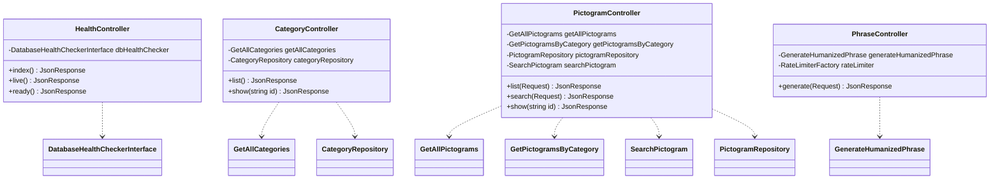
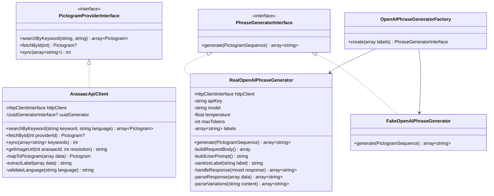
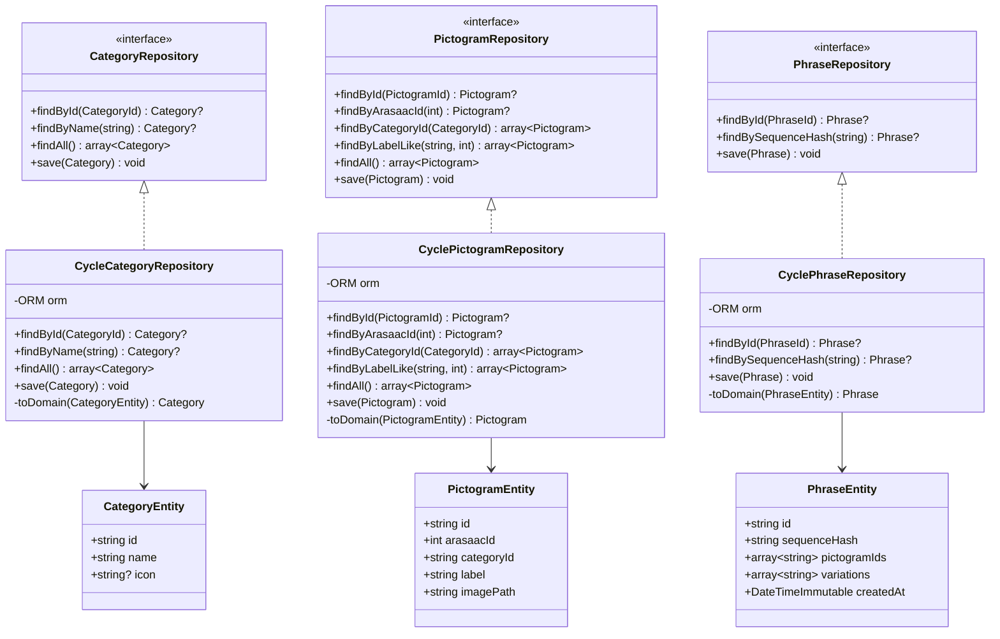
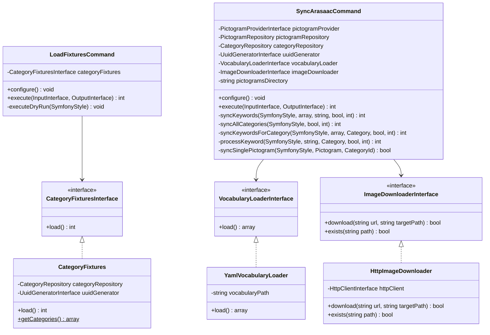
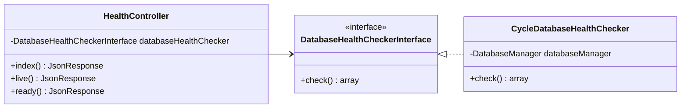
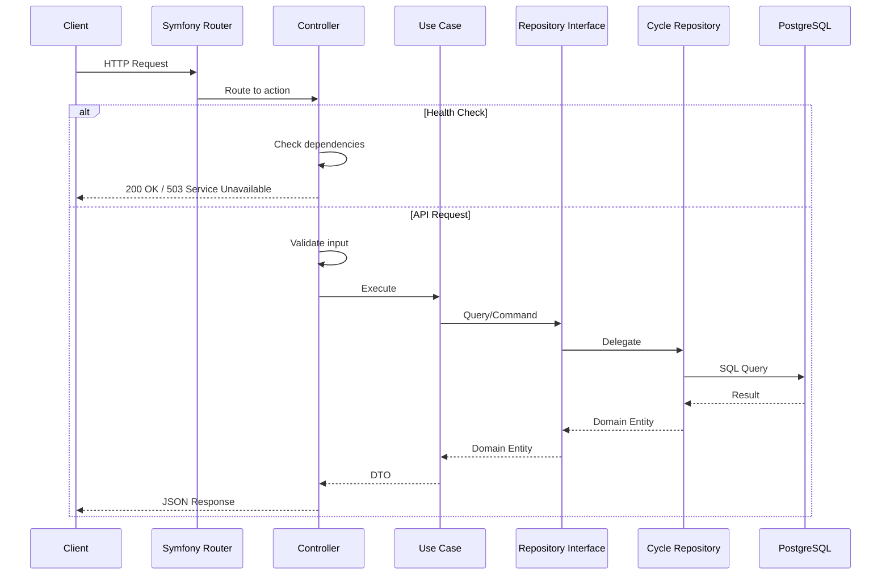
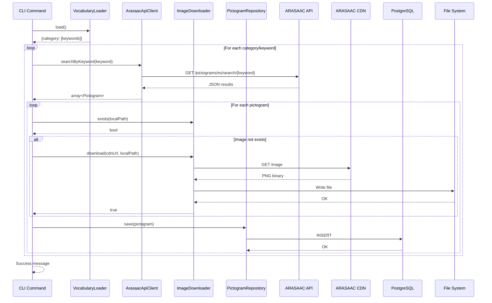

# Infrastructure Layer - Diagramas

> Diagramas del Infrastructure Layer de PictoSpeak AI

## Diagrama General de Componentes

```mermaid
graph TB
    subgraph Infrastructure["Infrastructure Layer"]
        subgraph Http["Http (Controllers)"]
            HC[HealthController]
            CC[CategoryController]
            PC[PictogramController]
            PhC[PhraseController]
        end

        subgraph Console["Console Commands"]
            LFC[LoadFixturesCommand]
            SAC[SyncArasaacCommand]
        end

        subgraph ExternalApi["External APIs"]
            AAC[ArasaacApiClient]
            OAI[OpenAIPhraseGenerator]
            FOAI[FakeOpenAIPhraseGenerator]
        end

        subgraph Persistence["Persistence (Cycle ORM)"]
            CCR[CycleCategoryRepository]
            CPR[CyclePictogramRepository]
            CPhR[CyclePhraseRepository]

            CE[CategoryEntity]
            PE[PictogramEntity]
            PhE[PhraseEntity]

            CM[CategoryMapper]
            PM[PictogramMapper]
            PhM[PhraseMapper]
        end

        subgraph Health["Health Checks"]
            DHC[CycleDatabaseHealthChecker]
        end

        subgraph Service["Services"]
            VL[YamlVocabularyLoader]
            ID[HttpImageDownloader]
        end

        subgraph DataFixtures["Data Fixtures"]
            CF[CategoryFixtures]
        end

        subgraph Shared["Shared"]
            UG[SymfonyUuidGenerator]
        end
    end

    subgraph Application["Application Layer"]
        UC1[GetAllCategories]
        UC2[GetAllPictograms]
        UC3[GetPictogramsByCategory]
        UC4[SearchPictogram]
        UC5[GenerateHumanizedPhrase]
    end

    subgraph Domain["Domain Layer"]
        CatRepo[CategoryRepository]
        PicRepo[PictogramRepository]
        PhrRepo[PhraseRepository]
        PPI[PictogramProviderInterface]
        PGI[PhraseGeneratorInterface]
        UGI[UuidGeneratorInterface]
    end

    subgraph External["External Services"]
        DB[(PostgreSQL)]
        ARASAAC[ARASAAC API]
        OpenAI[OpenAI API]
    end

    %% Controller -> Use Case
    CC --> UC1
    PC --> UC2
    PC --> UC3
    PC --> UC4
    PhC --> UC5

    %% Use Case -> Repository Interface
    UC1 --> CatRepo
    UC2 --> PicRepo
    UC3 --> PicRepo
    UC3 --> CatRepo
    UC4 --> PicRepo
    UC4 --> PPI
    UC5 --> PicRepo
    UC5 --> PhrRepo
    UC5 --> PGI

    %% Infrastructure implements Domain interfaces
    CCR -.-> CatRepo
    CPR -.-> PicRepo
    CPhR -.-> PhrRepo
    AAC -.-> PPI
    OAI -.-> PGI
    FOAI -.-> PGI
    UG -.-> UGI

    %% Persistence -> Database
    CCR --> DB
    CPR --> DB
    CPhR --> DB

    %% External API -> External Services
    AAC --> ARASAAC
    OAI --> OpenAI

    %% Health Check -> Database
    DHC --> DB
    HC --> DHC

    %% Console -> Services
    SAC --> AAC
    SAC --> VL
    SAC --> ID
    LFC --> CF

    style Infrastructure fill:#fff3e0
    style Application fill:#e3f2fd
    style Domain fill:#e8f5e9
    style External fill:#fce4ec
```

## Diagrama de Controllers HTTP

## Diagrama de External API Clients

## Diagrama de Persistence (Cycle ORM)

## Diagrama de Console Commands

## Diagrama de Health Checks

## Flujo de Request HTTP

## Flujo de Sincronizacion ARASAAC

## Resumen de Componentes

| Categoria | Componente | Responsabilidad |
|-----------|------------|-----------------|
| **Http** | `HealthController` | Health checks para orquestadores |
| **Http** | `CategoryController` | CRUD de categorias |
| **Http** | `PictogramController` | CRUD y busqueda de pictogramas |
| **Http** | `PhraseController` | Generacion de frases con rate limiting |
| **Console** | `LoadFixturesCommand` | Carga de categorias SAAC |
| **Console** | `SyncArasaacCommand` | Sincronizacion con ARASAAC |
| **ExternalApi** | `ArasaacApiClient` | Cliente ARASAAC API |
| **ExternalApi** | `RealOpenAIPhraseGenerator` | Generador con OpenAI |
| **ExternalApi** | `FakeOpenAIPhraseGenerator` | Fake para desarrollo |
| **Persistence** | `CycleCategoryRepository` | Persistencia de categorias |
| **Persistence** | `CyclePictogramRepository` | Persistencia de pictogramas |
| **Persistence** | `CyclePhraseRepository` | Persistencia de frases (cache) |
| **Health** | `CycleDatabaseHealthChecker` | Verificacion de conectividad DB |
| **Service** | `YamlVocabularyLoader` | Carga de vocabulario |
| **Service** | `HttpImageDownloader` | Descarga de imagenes |
| **Shared** | `SymfonyUuidGenerator` | Generacion de UUIDs |

## Principios Aplicados

| Principio | Aplicacion |
|-----------|------------|
| **Dependency Inversion** | Controllers dependen de Use Cases, no de Repositories |
| **Interface Segregation** | Interfaces especificas: `ImageDownloaderInterface`, `VocabularyLoaderInterface` |
| **Single Responsibility** | Cada servicio tiene una unica responsabilidad |
| **Open/Closed** | Nuevos proveedores (Claude, Gemini) sin modificar Use Cases |
| **Liskov Substitution** | `FakeOpenAIPhraseGenerator` intercambiable con `RealOpenAIPhraseGenerator` |
